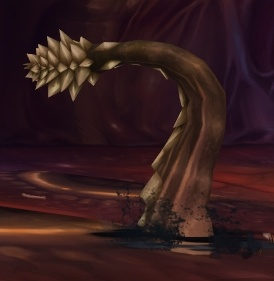
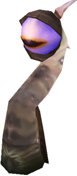
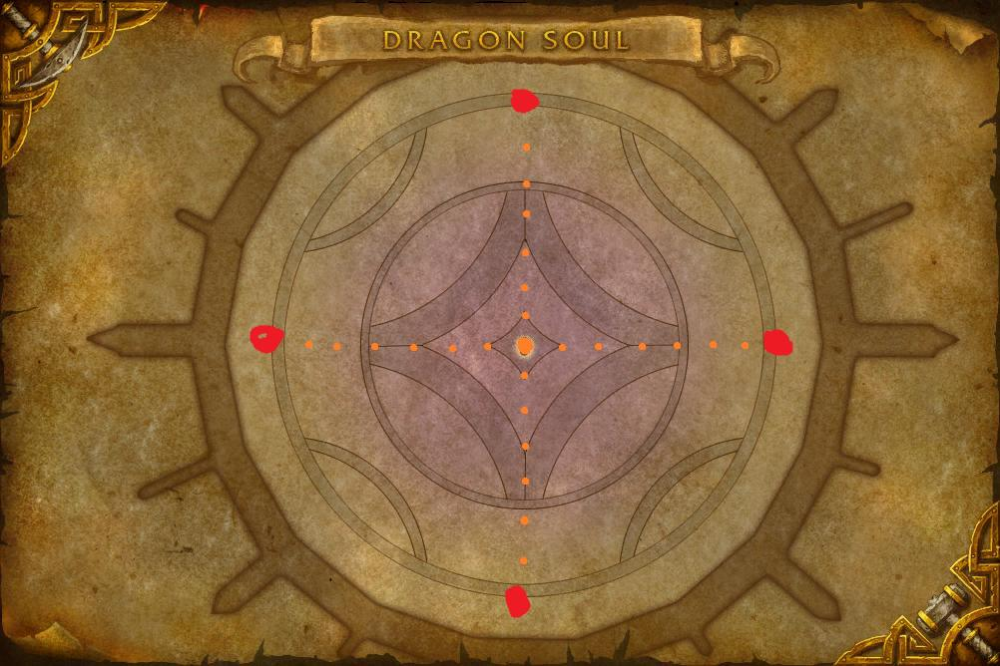
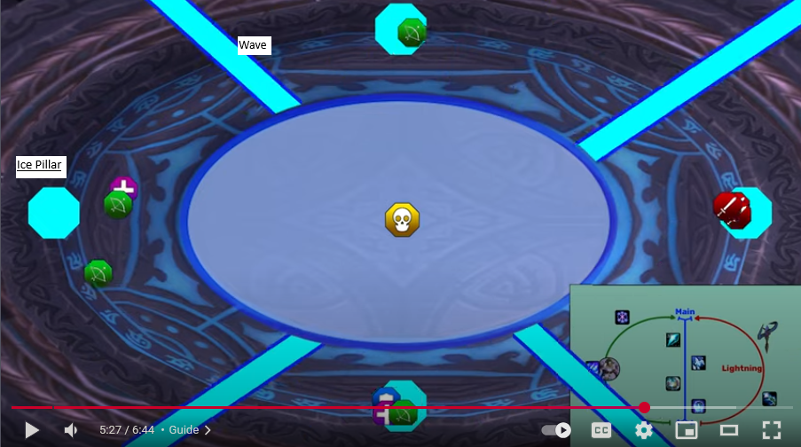

# Dragon Soul 

## Morchok / Kochrom
[Link to video](https://www.youtube.com/watch?v=FjxXU-Jndas)

Hero most likely at 20% as he hits hard.

### Phase 1
* Two boses with equal mechanics in this fight.
* Boss casts stomp every 15 seconds, this is a stack attack, stay within 25 yards of the boss.
* Boss throws out crystal which will target 7 closest players shooting damage toward them. There are three tiers of damage depending on how close you are to the crystal. Players should rush to the crystal then change from Red(too close) to Blue(far enough away to be in range but not dieing from the crystal).

### Phase 3
* Bosses such players in and then throw a bunch of spikes out. Get behind spikes to avoid the "Black Blood" the boss puts out.

## Yor'sahj the Unsleeping 
[Link to video](https://www.youtube.com/watch?v=xJsMJ1_1bzk&t=881s)

* Use CL Glyph
* Hero may be used for the number 4 combo.

### Boss info
* Kill adds that spawn but only the one you are supposed to kill. 
* Stack for most combiniations. 
* Spread when called out to spread on combo 6. (pers/hs here), get close to void right before it dies after a green bolt goes out.
* Combo 4 is probably when we will use hero due to lots of damage.

### Ooze Combinations
1. Black-Blue-Green-Purple; KILL: Green
2. Black-Blue-Green-Red; KILL: Green
3. Black-Blue-Purple-Yellow; Kill: Yellow
4. Black-Green-Red-Yellow; Kill: Green
5. Black-Purple-Red-Yellow; Kill: Yellow
6. Blue-Green-Purple-Yellow; Kill: Yellow

## Warlord Zon'ozz 
[Link to video](https://youtu.be/MCNkhM8mhVk?si=VE6F9ZmTTQK3fFjP)

### Boss info
Has a main phase and a second phase.

*Disrupting Shaows* - A dispellable debuff which does aoe damage when dispelled. Need to run out if you are 
going to dispell it.

*Void of the Unmaking* - Orb that does damage to those arround it. This ball is bounced between players until it hits the boss which moves him to the second phase. Looks like the mages handle bouncing the ball on 25 man.

#### Second Phase
Adds spawn, Need to kill them by priority.

1. Flail, looks like worm - (1 Priority) -  Someone must be in melee range of these or they do big damage to the raid.

2. Eye stalk - Cast when hunched down and can be interupted (2 Priority)

3. Tentacle (3 Priority) - No picture but these just look like regular tentacles.

## Hagara the Stormbinder 
[Link to video](https://www.youtube.com/watch?v=JnK2DrU8gQg)
### Boss Info

#### Main Phase
Start by spreading out. 3 blue balls are spawned and shoot ice lances which are an AOE at a few random persons. It provides a debuff so you need to cycle with another person before you get too many stacks. (Step in front of another person at 3/4 stacks)

*Shattered Ice*
A random hit at a person, also splashes.

*Ice Tomb*
Occurs once per main phase. You get a blue triangle on your head and after 10 seconds you get turned into an ice block. You should run to agara and stand under her to get your ice block cleaved down.

#### Lightning Phase
Lightning conductors are spawned. After the first one is taken down you try to create a chain of players (10 yards apart) to transfer the charge to the other conductors.

**Conductors**

There are storm pillars which will spawn but damage can be healed through from this. 

After all conductors are activated you get 15 seconds of 2X damage on boss.

#### Ice Phase
Avoid the watery entrenchment in the center of the room. 4 crystals are spawned on the outer edges of the arena. There are 4 waves that are spawned and rotate clockwise arround the arena. Damage the crystals as you move about and dodge the ice crystals that are Spawned. There is a ramping dispellable debuff which you should dip into the middle puddle to get dispelled to avoid dropping a puddle.

## Ultraxion 
[Link to video](https://youtu.be/gs1B1gvBIqQ?si=ZZXuCWSa__b0JPwz)

One phase fight. NPCs give buffs, healers will probably be assigned specific buffs to specific people.

Start stacked in front of the boss. Everyone gets extra button which will transport you out of the Twilight Realm where you are fighting the boss. When *Hour of Twilight* is cast you should click the button unless you are assigned to soak. (Will probably have rotating groups to handle this)

6 min dps check due to enrage. 

## Warmaster Blackhorn 
[Video Link](https://www.youtube.com/watch?v=YOGnVG1pHL4) - This video is old and pretty bad. Hopefully someone uploads a better video soon. 

Two phase fight. 

Phase 1 add control.
Phase 2 burn phase.
### Phase 1 
aAoid the fire which are spawned as the fight starts and continually after that.. 

You will need to soak *Twilight Barage* from the drakes but there is a debuff so you need to rotate with another player. I assume these will be assigned.

*Twilight Enslaught* - should stack and use a raid cd during these. 

### Phase 2
Don't stand too close to the dragon to avoid getting silenced and burn the dragon before killing Blackhorn. Stack up and move left or right as needed to avoid the shockwave.

## Spine of Deathwing 
Haven't found much on this fight yet but seems low mechanics for DPS.

[Link to tank video](https://youtu.be/yOmOtVWABQw?si=2nKhFt1DcSBkBmjV)
Adds fight. Kill the adds as called out and don't fall off by making sure you are grasped when necessary.

## Madness of Deathwing 
Haven't found much on this fight yet, will keep looking.
